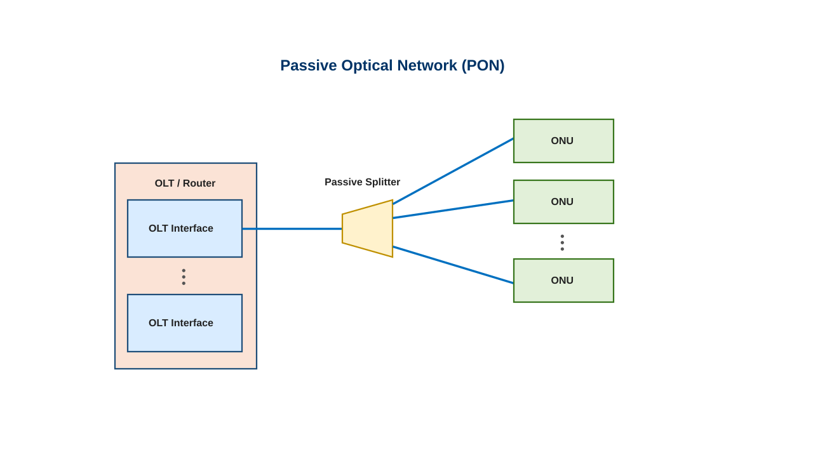
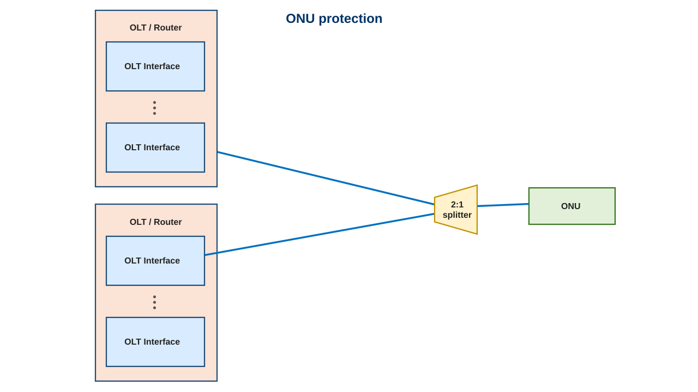
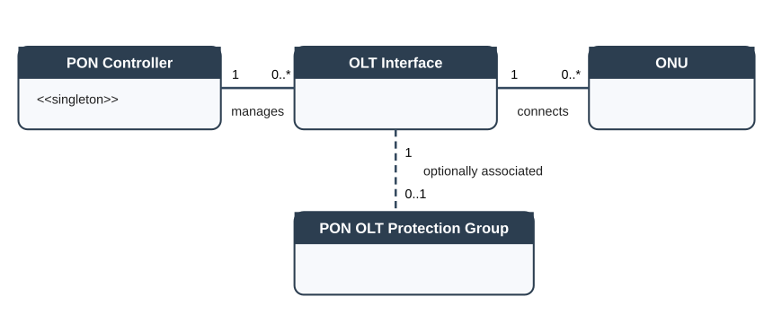
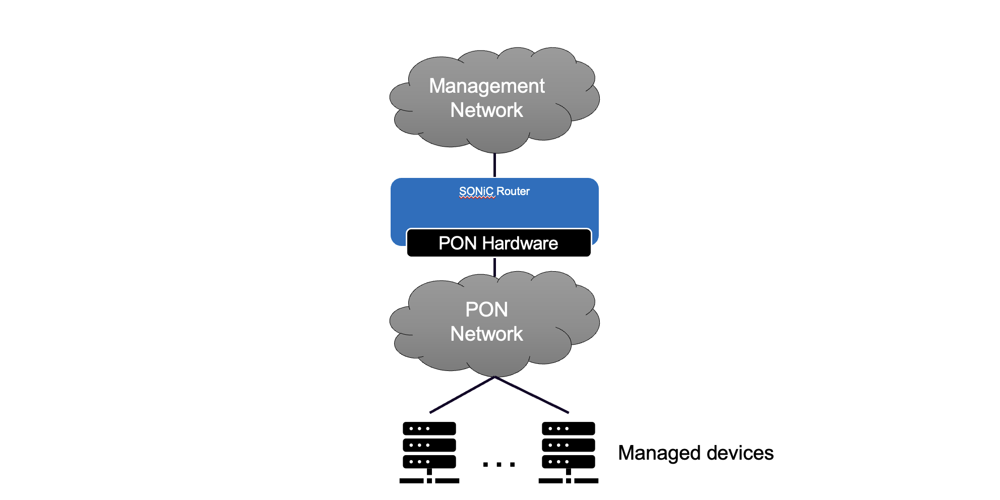

# SAI for Passive Optical Network (PON) components

| Title       | SAI PON
--------------|-----------------------------------------------------------------
| Authors     | Dave Pelton, Ciena
|             | Kam Wun Leung, Ciena
| Status      | In Review
| Type        | Experimental
| Created     | 2026/09/09
| Updated     | 2026/09/09
| SAI-Version | 1.19

## Table of Contents

1. [Scope](#1-scope)
2. [Why SONiC for PON](#2-why-sonic-for-pon)
   - [PON overview](#pon-overview)
   - [PON Model](#pon-model)
   - [DCOM overview](#dcom-overview)
3. [SAI for PON](#3-sai-for-pon)
   - [3.1 Experimental PON Objects](#31-experimental-pon-objects)
   - [3.2 SAI PON notification](#32-sai-pon-notification)

## Definitions and Abbreviations

| Term              | Meaning                                                                     |
|-------------------|-----------------------------------------------------------------------------|
| DCOM              | Data Center Out-of-band Management                                          |
| PON               | Passive Optical Network                                                     |
| OLT               | Optical Line Terminal — the PON head-end device managed by this feature.    |
| OLT Interface     | An optical interface associated with an OLT, which is connected to a set of downstream ONUs. |
| OLT Plug          | aka micro OLT (uOLT) — a small form factor optical plug that combines the OLT function and the OLT interface into one device. |
| ONU               | Optical Network Unit — a PON subscriber-side endpoint.                      |

## 1. Scope

This document defines the experimental API in Open Compute Project Switch Abstraction Interface (SAI)
used to support the management of PON components.  The current scope is limited to APIs required for DCOM
applications.

## 2. Why SONiC for PON

PON provides a cost-effective out-of-band management fabric for downstream devices such as GPUs, consoles,
and other datacenter endpoints.  This API allows SONiC and other SAI compliant NOS to operate on routers
and/or switches that have PON hardware.  This includes cases where PON hardware is intrinsic to the device
in a traditional OLT configuration, or added to a standard router via pluggable OLTs.

### PON overview

PON deployments consist of a head end device connected into a L2 or L3 network, and optical fibers that are passively split to provide service to multiple endpoints on a single head end fiber.

For deployments where protection is necessary, ONU endpoints can be connected to multiple OLT interfaces:

### PON Model

PON is modeled in SAI by the following components:

| Object | Description |
|-----------|-------------|
| PON controller | represents global settings for the PON head-end device. |
| OLT interface | represents the head-end fiber termination for a PON. There can be many OLT interfaces mapped to a single PON controller, and there can be many ONUs subtended from a single OLT interface. |
| ONU | represents the subscriber end of the PON. |
| OLT protection group | optionally used to represent a protection group where a pair of OLTs serve the same set of ONUs |

### DCOM overview

The DCOM deployment targeted by this iteration of the PON SAI interface uses PON to fan-out management network
connectivity to multiple managed devices in the data center.  This limited deployment scenario means
that parameters specific to residential PON deployments are not required.

## 3. SAI for PON

The PON SAI definition provides the following core functions:
* creation and removal of PON components
* retrieval of current operational status of PON components
* notification handling for failures and hardware data reporting

All PON objects are subobjects of the switch root element and do not associate or interact with
existing non-PON SAI objects.

### 3.1 Experimental PON Objects

The following sections describe the objects used in this SAI definition.  These have been derived from the proposed SONiC YANG models for PON.

#### 3.1.1 SAI PON controller object

* [PON controller hierarchy](PON_CONTROLLER_hierarchy.md)

#### 3.1.2 SAI OLT interface objects

* [PON OLT interface](PON_OLT_INTF_hierarchy.md)
* [PON OLT interface state](PON_OLT_INTF_STATE_hierarchy.md)

#### 3.1.3 SAI ONU objects

* [PON ONU](PON_ONU_hierarchy.md)
* [PON ONU template](PON_ONU_TEMPLATE_hierarchy.md)
* [PON ONU state](PON_ONU_STATE_hierarchy.md)
* [PON SLA profile](PON_SLA_PROFILE_hierarchy.md)
* [Service configuration profile](PON_SERVICE_CONFIG_PROFILE_00_INDEX.md)

### 3.2 SAI PON notification

SONiC has a notification mechanism supporting notifications from Vendor SAI (driver) to SWSS. Currently
the notification is only supported by the root SAI object (switch), in which all notification callback
attributes and prototypes are defined in `saiswitch.h`.

In order to separate PON notification code from the existing switch code, a notification attribute for PON is declared in SAI extension `saiswitchextensions.h`. 